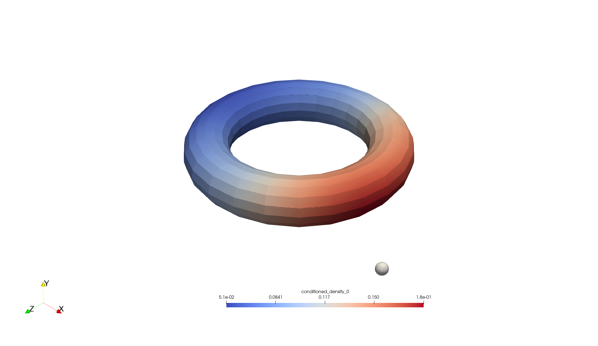
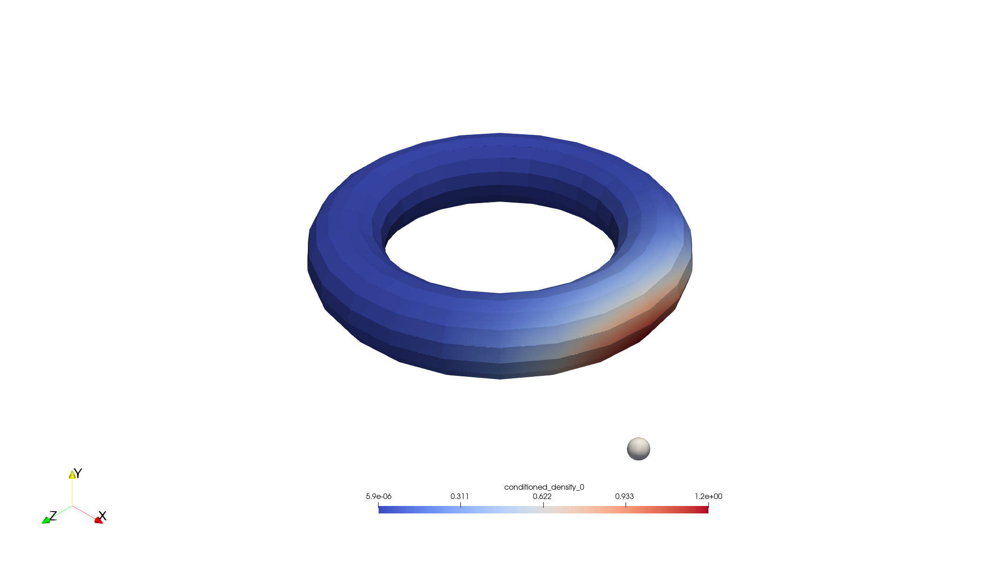
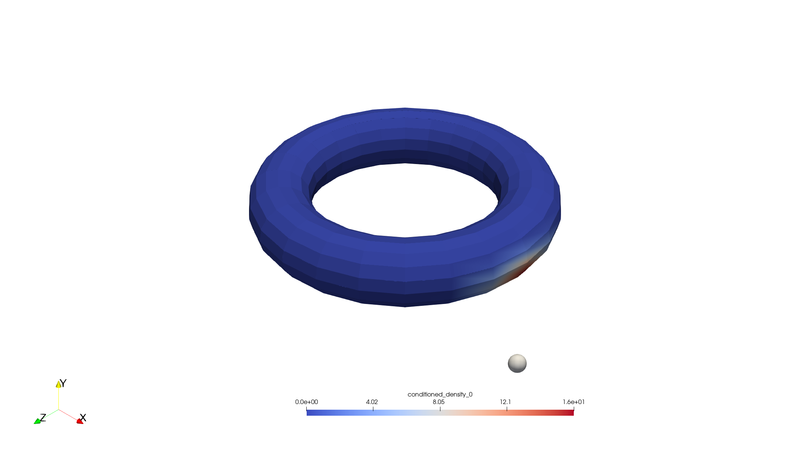

# Tutorial 2: Computing and Visualizing Conditional Densities in Optimal Transport

## 1. Overview

This tutorial provides a practical, step-by-step guide to solving a **semi-discrete optimal transport (OT)** problem. Its primary focus is to compute and understand one of its most insightful results: the **conditional probability density**.

We consider the problem of transporting a continuous mass distribution, $\mu(x)$, defined on a 3D torus, to a discrete set of target points, $\nu = \sum_{j=1}^N \nu_j \delta_{y_j}$. By solving this problem, we can answer a key question in many applications: **"Given that a unit of mass arrived at a specific target $y_j$, what is the probability distribution of its point of origin $x$?"** The answer is the conditional density $\rho_j(x)$, which this tutorial computes and visualizes.

## 2. Core Concepts: From the Transport Plan to Conditional Densities

### The Transport Plan and its Decomposition

The solution to an optimal transport problem is a **transport plan**, $\gamma(x,y)$, which is a joint probability measure describing how mass from source locations $x$ is distributed among target locations $y$. For a continuous source and discrete target, this plan can be decomposed using the law of conditional probability:

$$
d\gamma(x, y_j) = \pi(y_j|x) \, d\mu(x)
$$

Here, $\pi(y_j|x)$ is the **conditional probability** of mapping from a source point $x$ to a specific target point $y_j$. For the entropic regularized OT problem, this probability is given by the potentials $\{\psi_k\}$:

$$
\pi(y_j|x) = \frac{ \exp\left(\frac{\psi_j - C(x, y_j)}{\varepsilon}\right) \nu_j }{ \sum_{k=1}^N \exp\left(\frac{\psi_k - C(x, y_k)}{\varepsilon}\right) \nu_k }
$$

where $C(x, y) = \frac{1}{2}\|x - y\|^2$ and $\varepsilon$ is the regularization parameter.

### Partitioning the Source Measure

Using this conditional probability, we can define the **transport density component** mapped to target $y_j$. This is the portion of the source density $\mu(x)$ that is transported to $y_j$:

$$
d\mu_j(x) := \pi(y_j|x) \, \mu(x)
$$

This quantity is incredibly useful for visualization as it provides a perfect decomposition of the source measure:
1.  **It partitions the source density:** $\sum_{j=1}^{N} d\mu_j(x) = \mu(x)$.
2.  **It integrates to the target's mass:** $\int_X d\mu_j(x) \, dx = \nu_j$.

### The Conditional Probability Density

The main goal of this tutorial is to compute the **conditional probability density $\rho_j(x)$**. This answers the inverse question: "Given that mass arrived at target $y_j$, what is the probability distribution of its origin?" Using Bayes' theorem, we can define it as:

$$
\rho_j(x) = \frac{\pi(y_j|x) \mu(x)}{\int_X \pi(y_j|x') d\mu(x')} = \frac{d\mu_j(x)}{\nu_j}
$$

By substituting the expression for $d\mu_j(x)$, we arrive at the final formula that this tutorial implements:

$$
\rho_j(x) = \mu(x) \frac{ \exp\left(\frac{\psi_j - C(x, y_j)}{\varepsilon}\right) }{ \sum_{k=1}^N \exp\left(\frac{\psi_k - C(x, y_k)}{\varepsilon}\right) \nu_k }
$$

This is a proper probability density function, meaning it is non-negative and integrates to 1 over the source domain:

$$
\int_X \rho_j(x) \, dx = 1
$$

## 3. Implementation Workflow

The program executes the following steps:
1.  **Setup Domains**: A continuous source domain (a 3D torus) and a discrete target domain (vertices of a 3D simplex) are defined using `deal.II`.
2.  **Define Measures**:
    -   **Source $\mu(x)$**: A smooth density is generated on the torus using a normalized Laplacian eigenfunction.
    -   **Target $\nu$**: A discrete measure is defined on the simplex vertices with uniform weights $\nu_j = 1/N$.
3.  **Solve for Potentials**: The `SotSolver` computes the optimal OT potentials $\{\psi_j\}$ for the given measures and regularization parameter $\varepsilon$.
4.  **Compute Conditional Densities**: The `get_potential_conditioned_density()` function is called. It uses the potentials, measures, and the formula for $\rho_j(x)$ to calculate the set of conditional probability densities as `deal.II` distributed vectors.
5.  **Output Results**: The source density, target points, and the computed conditional densities are saved to disk in VTK/VTU and PLY formats for visualization.

## 4. How to Run and Configure

### Execution
The compiled executable can be run in serial or parallel, accepting a parameter file as an argument:
```bash
# Run on 4 cores
mpirun -n 4 ./tutorial-2 parameters.prm
```

### Key Configuration
The `parameters.prm` file controls the simulation's behavior.
```prm
# In parameters.prm

# Control number of output fields
set number of conditioned densities = 4

# Control sharpness of the conditional densities
set epsilon = 1e-2
```

## 5. Visualizing and Interpreting the Results

### Output Files
-   `output/data_mesh/target_points.ply`: The discrete target points.
-   `output/density_field/source_density_0.pvtu`: The input source density $\mu(x)$.
-   `output/density_field/conditioned_densities_0.pvtu`: The primary output, containing all computed conditional probability densities $\rho_j(x)$. The fields are named `conditioned_density_0`, `conditioned_density_1`, etc.

### General Interpretation
Use a visualization tool like **ParaView** to open the `.pvtu` files.
1.  Open `conditioned_densities_0.pvtu`.
2.  In the ParaView toolbar, use the dropdown menu to select and view the different fields.
3.  Overlay `target_points.ply` to see the target locations.

By selecting `conditioned_density_0`, you are visualizing the distribution $\rho_0(x)$. The bright (red) regions indicate the areas of the source domain that are most likely to be mapped to target $y_0$. Switching between the different `conditioned_density_i` fields reveals the "region of influence" for each target point under the optimal transport map.

### The Role of the Regularization Parameter ($\varepsilon$)
The `epsilon` parameter is crucial as it controls the "randomness" or "diffusion" of the optimal transport plan. As you change its value, the shape of the conditional densities changes dramatically:

-   **Large $\varepsilon$**: The transport is highly regularized (more "entropic"). The conditional density is diffuse and spread out over a large area of the source domain. This indicates that mass arriving at a target could have originated from many different places.
-   **Small $\varepsilon$**: The transport is closer to the deterministic, unregularized problem. The conditional density becomes highly **concentrated** and "shrinks" to a small, well-defined region. This indicates that mass arriving at a target almost certainly originated from a very specific area.

This effect is clearly visible in the results below for `conditioned_density_0`. As `epsilon` decreases from 10.0 to 0.1, the red region of high probability shrinks and intensifies around the part of the torus closest to the target point.

| Epsilon = 10.0                                          | Epsilon = 1.0                                         | Epsilon = 0.1                                         |
| :------------------------------------------------------: | :----------------------------------------------------: | :----------------------------------------------------: |
|  |  |  |

## 6. Further Exploration
-   **Experiment with $\varepsilon$**: Re-run the simulation with different values for `epsilon` in the `parameters.prm` file to reproduce the "shrinking" effect shown above. Observe how the solution changes.
-   **Change Geometries**: Modify the `setup_system` function to use different source or target geometries. How does the transport plan change if the source is a sphere and the targets are randomly distributed inside?
-   **Non-Uniform Target Weights**: Modify the code to assign non-uniform weights (`target_density`) to the target points and observe how this affects the size and shape of the conditional density regions.
