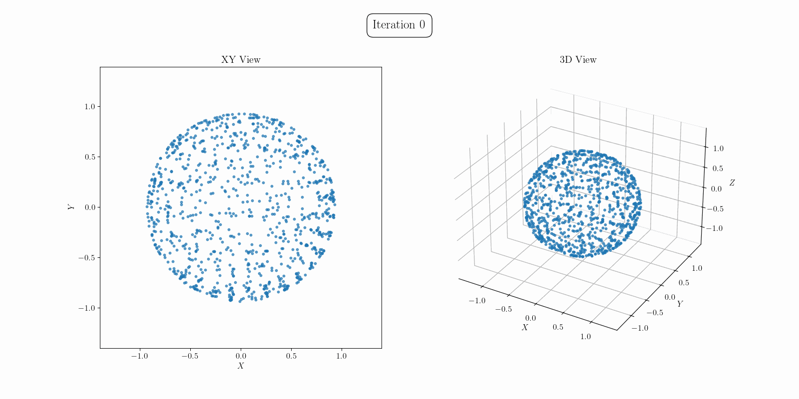
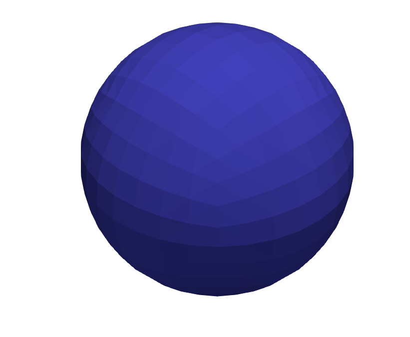
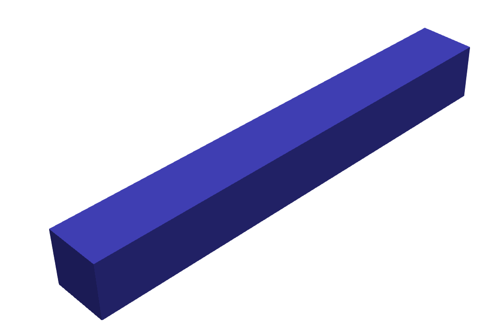
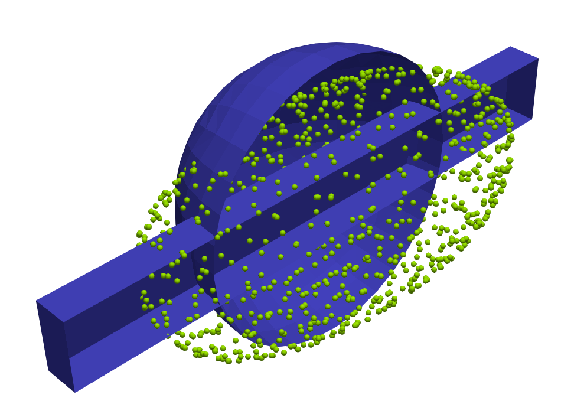

# Tutorial 4: Wasserstein Barycenter Computation

## Overview

This tutorial demonstrates the computation of **Wasserstein barycenters** between two surfaces in 3D using the `SemiDiscreteOT` library. A Wasserstein barycenter provides a principled way to compute the geometric average of probability measures, preserving their underlying geometric structure in a way that simple linear averaging cannot.

The barycenter $\nu^*$ of a set of measures $\{\mu_i\}_{i=1}^K$ with weights $\{\lambda_i\}_{i=1}^K$ (where $\sum \lambda_i = 1$) minimizes the weighted sum of regularized transport costs:

$$\nu^* = \arg\min_\nu \sum_{i=1}^K \lambda_i \mathcal{W}_{\varepsilon,c}(\mu_i, \nu)$$

This tutorial showcases two different optimization approaches for computing barycenters:
1. **Lloyd Algorithm**: A classical fixed-point iteration method
2. **Gradient Descent**: A more robust optimization approach using R-tree acceleration

## Mathematical Formulation

### Barycenter Problem

We seek a discrete barycenter $\nu = \sum_{j=1}^{N_b} \nu_j \delta_{y_j}$ with fixed uniform weights $\nu_j = 1/N_b$, which transforms the problem into an optimization over the support point locations $Y = \{y_j\}_{j=1}^{N_b}$.

For the squared Euclidean cost $c(x,y) = \frac{1}{2}\|x-y\|^2$, the optimality condition for a barycenter point $y_j^*$ leads to a fixed-point equation:

$$y_j^* = \sum_{i=1}^K \lambda_i T_{i,j}^*$$

Here, $T_{i,j}$ is the conditional barycenter (centroid) of the transport plan component that maps mass from source $\mu_i$ to barycenter point $y_j$.

### Lloyd Algorithm

The Lloyd algorithm implements a fixed-point iteration with damping parameter $\theta$:

$$y_j^{(t+1)} = (1-\theta) y_j^{(t)} + \theta \sum_{i=1}^K \lambda_i T_{i,j}^{(t)}$$

### Gradient Descent Approach

The gradient descent method optimizes the barycenter locations directly by computing gradients of the objective function. This approach uses R-tree spatial indexing for efficient nearest neighbor queries, significantly accelerating the computation for large-scale problems.

## Implementation Details

### Source Geometries

The tutorial works with two surfaces in 3D (dim = 2, spacedim = 3):
- **Source 1**: A cylinder surface with uniform density distribution
- **Source 2**: A sphere surface with uniform density distribution

Both sources are discretized using finite element meshes loaded from mesh files.

### Barycenter Configuration

The number of barycenter points can be controlled via the `n_barycenter_points` parameter. The initialization of these points can be configured through several options:

- **Random Initialization**: When `random_initialization = true`, points are randomly distributed within specified bounds (`initial_bounds_min` and `initial_bounds_max`)
- **Sampling-based Initialization**: When `random_initialization = false`, points are sampled from one of the source geometries specified by `sampling_id` (0=both sources, 1=source1, 2=source2)
- **Random Seed**: The `random_seed` parameter ensures reproducible results for random initialization

## How to Run

The tutorial provides two executables for different optimization approaches:
- `tutorial_4_lloyd`: Implements the Lloyd algorithm
- `tutorial_4_gradient_descent`: Implements gradient descent with R-tree acceleration

## Parameter Configuration

### Lloyd Parameters (`parameters_lloyd.prm`)

```prm
subsection Barycenter
  set max_iterations = 50
  set convergence_tolerance = 1e-6
  set weight_1 = 0.5                    # Weight for first source
  set weight_2 = 0.5                    # Weight for second source
  set random_initialization = false
  set volume_scaling = 1.0
end

subsection SotParameterManager
  set selected_task = lloyd
  
  subsection rsot_solver
    set epsilon = 1e-2                  # Regularization parameter
    set tolerance = 1e-3                # RSOT solver tolerance
    set max_iterations = 10000          # Maximum RSOT iterations
  end
end
```

### Gradient Descent Parameters (`parameters_gradient.prm`)

```prm
subsection Barycenter
  set max_iterations = 100
  set convergence_tolerance = 1e-8
  set weight_1 = 0.5
  set weight_2 = 0.5
  set learning_rate = 0.1              # Gradient descent step size
  set use_rtree_acceleration = true    # Enable R-tree acceleration
end

subsection SotParameterManager
  set selected_task = gradient_descent
  
  subsection rsot_solver
    set epsilon = 1e-2
    set tolerance = 1e-3
    set max_iterations = 10000
  end
end
```

## Results and Visualization

### Output Files

The tutorial generates several output files for visualization:

1. **Source Geometries**:
   - `output/data_mesh/source_1.vtk` - First source geometry
   - `output/data_mesh/source_2.vtk` - Second source geometry

2. **Barycenter Evolution**:
   - `output/barycenter_initial.vtk` - Initial barycenter configuration
   - `barycenter_iter_*.vtk` - Barycenter at each iteration
   - `barycenter_final.vtk` - Final optimized barycenter


### Interactive Visualization with Python

The tutorial includes a Python visualization script `run/slider.py` that provides an interactive 3D plot with a slider-based interface to scrub through barycenter iterations, convergence analysis plots showing RMS point movement and point cloud spread evolution, and animation export that generates a GIF with both XY view and 3D view of the evolution.

To use the visualization script:
```bash
python3 slider.py
```

The script automatically finds and processes all `barycenter_*.txt` files, creating an interactive visualization and saving an animation as `barycenter_evolution.gif`.



### Visualization with ParaView

When `save_vtk` is set to true in the parameter files, the tutorial generates VTK files that can be displayed in ParaView. You can open ParaView and load the source geometries to understand the input data, load the barycenter evolution files to observe the optimization process, and overlay source and barycenter geometries to analyze the geometric averaging.


### Visual Examples

 |  | 
:------------------:|:------------------:|:------------------------:
Source Geometry 1   | Source Geometry 2  | Computed Barycenter

## Further Exploration

- **Different Weights**: Experiment with non-uniform weights $\lambda_1, \lambda_2$ to bias the barycenter toward one source
- **Multiple Sources**: Extend to compute barycenters of more than two geometries
- **Regularization Effects**: Study how the regularization parameter $\varepsilon$ affects the barycenter shape
- **Cost Functions**: Implement different cost functions beyond squared Euclidean distance

## References

This tutorial implements the Wasserstein barycenter computation described in Section 6.3 of the [accompanying paper](https://arxiv.org/abs/2507.23602). For theoretical background, see:

- Agueh, M., & Carlier, G. (2011). Barycenters in the Wasserstein space. *SIAM Journal on Mathematical Analysis*, 43(2), 904-924.
- Cuturi, M., & Doucet, A. (2014). Fast computation of Wasserstein barycenters. *International Conference on Machine Learning*.