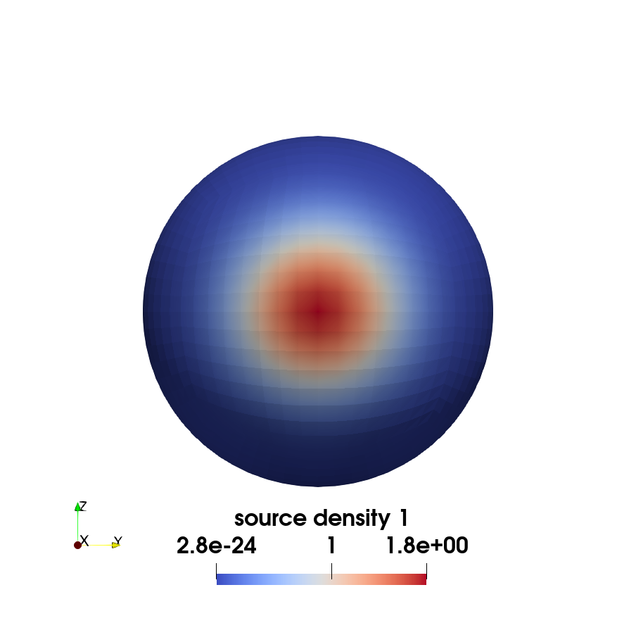
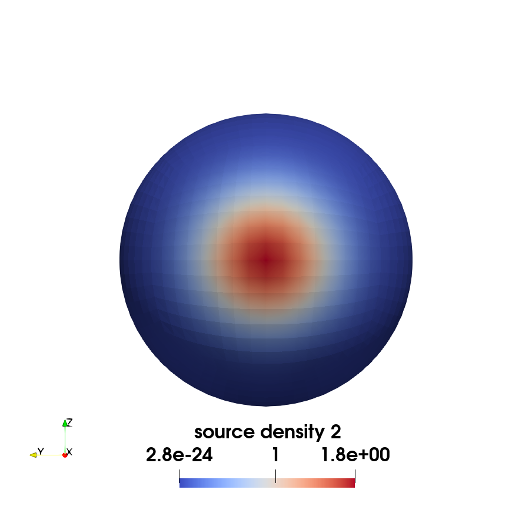
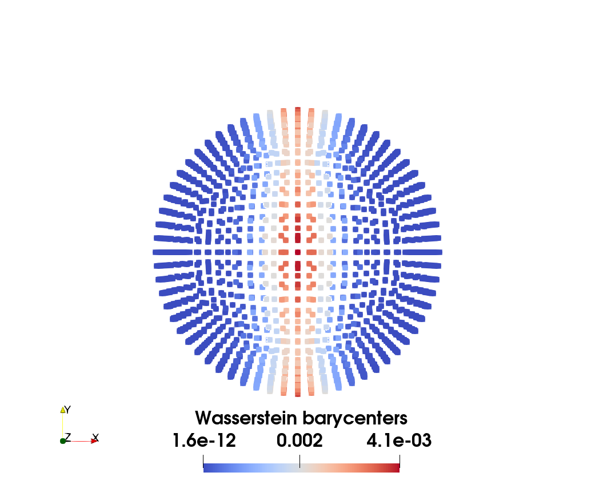

# Tutorial 5: Wasserstein Barycenter with Fixed Support on the Unit Sphere

## Overview

This tutorial demonstrates the computation of **Wasserstein barycenters** between two finite element vectors supported on the same sphere, using the `SemiDiscreteOT` library. A Wasserstein barycenter provides a principled way to compute the geometric average of probability measures, preserving their underlying geometric structure in a way that simple linear averaging cannot.

The barycenter $\nu^*$ of a set of measures $\{\mu_i\}_{i=1}^K$ with weights $\{\lambda_i\}_{i=1}^K$ (where $\sum \lambda_i = 1$) minimizes the weighted sum of regularized transport costs:

$$\nu^* = \arg\min_\nu \sum_{i=1}^K \lambda_i \mathcal{W}_{\varepsilon,c}(\mu_i, \nu)$$

This tutorial showcases how to use **Gradient Descent**  for computing barycenters of measures supported on the same mesh.

## Mathematical Formulation

### Barycenter Problem

We seek a discrete barycenter $\nu = \sum_{j=1}^{N_b} \nu_j \delta_{y_j}$ with non-uniform weights, with fixed support point locations $Y = \{y_j\}_{j=1}^{N_b}$.

We have

$$\mathcal{W}_{\varepsilon,c}(\mu_i, \nu)=\sup_{\psi\in\mathbb{R}^N}\left\{\sum_{j=1}^{N}\psi_j\nu_j-\int_{\Omega}\epsilon\log\left(\sum_{j=1}^N\nu_j\exp{(\psi_j-c(x, y_j))/\epsilon}\right)\rho(x)\,dx\right\}$$

where $c$ in this tutorial is the geodesic distance on the unit sphere.

The gradient descent method optimizes the barycenter locations directly by computing gradients of the objective function. This approach uses R-tree spatial indexing for efficient nearest neighbor queries, significantly accelerating the computation for large-scale problems.

Keeping $Y$ fixed, the computation of the gradient results into:
$$\begin{aligned}
\sum_{i=1}^K \lambda_i\nabla_{\nu}\mathcal{W}_{\varepsilon,c}(\mu_i, \nu)&=\sum_{i=1}^K \lambda_i\nabla_{\nu}\sup_{\psi\in\mathbb{R}^N}\left\{\sum_{j=1}^{N}\psi_j\nu_j-\int_{\Omega}\epsilon\log\left(\sum_{j=1}^N\nu_j\exp{((\psi_j-c(x, y_j))/\epsilon)}\right)\rho(x)\,dx\right\}\\
&=\sum_{i=1}^K \lambda_i\sup_{\psi\in\mathbb{R}^N}\left\{\psi-\int_{\Omega}\frac{\exp{((\psi-c(x, Y))/\epsilon)}}{\sum_{j=1}^N\nu_j\exp{((\psi_j-c(x, y_j))/\epsilon)}}\rho(x)\,dx\right\}\in\mathbb{R}^{N_b}
\end{aligned}$$
where $\exp{((\psi-c(x, Y))/\epsilon)}$ is the vector:
$$\exp{((\psi-c(x, Y))/\epsilon)}_j = \exp{((\psi_j-c(x, y_j))/\epsilon)}$$

In order to preserve the positivity and sum to 1 property of the measure $\nu$ at each optimization step, we will update the discrete measure with a simple trick:
$$\begin{aligned}
  \delta\nu &= \sum_{i=1}^K \lambda_i\nabla_{\nu}\mathcal{W}_{\varepsilon,c}(\mu_i, \nu)\\
  \nu&\leftarrow \nu\odot\exp(-\alpha\nu\odot\delta\nu)\\
  \nu&\leftarrow \nu\oslash\lVert\nu\rVert_1
\end{aligned}
$$

### Visual Examples
Given two Gaussians supported on the unit sphere with mean at $(1, 0, 0)$ and $(-1, 0, 0)$, the Wasserstein barycenter with weight $\boldsymbol{\lambda}=(0.5, 0.5)$ is not unique.

 |  | 
:------------------:|:------------------:|:------------------------:
Source Geometry 1   | Source Geometry 2  | Computed Barycenter

## References

This tutorial implements the Wasserstein barycenter computation described in Section 6.3 of the [accompanying paper](https://arxiv.org/abs/2507.23602) but applied to fields with the same support. For theoretical background, see:

- Agueh, M., & Carlier, G. (2011). Barycenters in the Wasserstein space. *SIAM Journal on Mathematical Analysis*, 43(2), 904-924.
- Cuturi, M., & Doucet, A. (2014). Fast computation of Wasserstein barycenters. *International Conference on Machine Learning*.

and applications:
- Khamlich, M., et al. (2025) Optimal transport-based displacement interpolation with data augmentation for reduced order modeling of nonlinear dynamical systems.*Journal of Computational Physics* 531 : 113938.