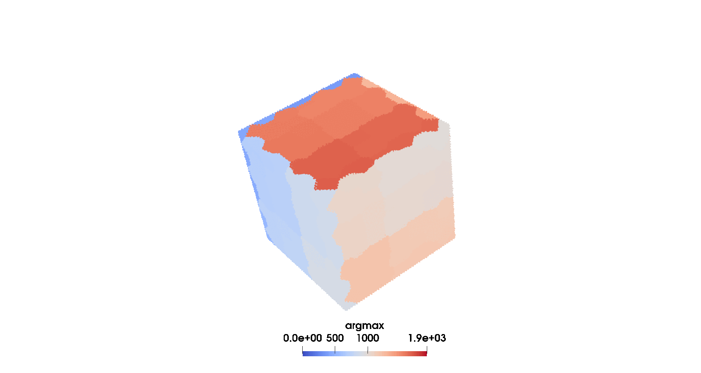

# Tutorial 6: Semi-Discrete OT and Regularized Semi-Discrete OT on GPU (with Kokkos)

## Overview

This tutorial tests the implementation of the vanilla Semi-Discrete OT (SOT) and Regularized Semi-Discrete OT (RSOT) on GPUs with [Kokkos](https://kokkos.org). For the moment, only non multivel and shared memory implementations are provided. You can run the different algorithms changing `task` in the file `run/parameters.prm` to `kokkossot` for SOT on GPU `kokkosrsot` for RSOT on GPU and `rsot` for RSOT on CPU.

## Mathematical Formulation
We briefly recall the minimization problems related to the SOT and RSOT problems. In both cases, given the source continuous domain $\Omega\subset\mathbb{R}^d$ with continuous measure (probability density) $\rho(\mathbf{x})$, and the target discrete measure with support points $\{\mathbf{y}_i\}_{i=1}^N\subset\mathbb{R}^d$ and discrete probability mass $\{\nu_i\}_{i=1}^N$ s.t. $\sum_{i=1}^N \nu_i = 1$, the aim is to find the discrete potentials $\psi = \{\psi_i\}_{i=1}^N$ that minimize the following functionals.

### Semi-Discrete Optimal Transport

$$ \min_{\psi\in\mathbb{R}^N} J_{\text{SOT}}(\psi)=\min_{\phi\in\mathbb{R}^N} \int_{\Omega} \max_i (\psi_i-c(\mathbf{x, \mathbf{y}_i})) \rho(\mathbf{x})\,d\mathbf{x} - \sum_{i=1}^N \nu_i\psi_i,$$

with gradients

$$ [\nabla J_{\text{SOT}}(\psi)]_i = \int_{Pow_i(\psi)}\rho(\mathbf{x})\,d\mathbf{x}-\nu_i,\qquad \text{with}\quad Pow_i(\psi)=\{\mathbf{x}\in\Omega|\ \psi_i-c(\mathbf{x},\mathbf{y}_i)>\psi_j-c(\mathbf{x},\mathbf{y}_j),\ \forall j\}.$$

### Regularized Semi-Discrete Optimal Transport

$$ \min_{\psi\in\mathbb{R}^N} J_{\text{RSOT}}(\psi)=\min_{\phi\in\mathbb{R}^N} \int_{\Omega} \varepsilon \log\left(\sum_{i=1}^N \nu_i \exp\left(\frac{\psi_i-c(\mathbf{x, \mathbf{y}_i})}{\epsilon}\right)\right) \rho(\mathbf{x})\,d\mathbf{x} - \sum_{i=1}^N \nu_i\psi_i,$$

with gradients

$$ [\nabla J_{\text{RSOT}}(\psi)]_i = \int_{\Omega}\frac{\nu_i\exp\left((\psi_i-c(\mathbf{x, \mathbf{y}_i}))/\epsilon\right)}{\sum_{i=1}^N \nu_i \exp\left((\psi_i-c(\mathbf{x, \mathbf{y}_i}))/\epsilon\right)}\rho(\mathbf{x})\,d\mathbf{x}-\nu_i.$$

### Visual Examples

## References

This tutorial implements the SOT and RSOT algorithms on GPUs, the result are reported on the third section of the appendix of the [accompanying paper](https://arxiv.org/abs/2507.23602). For theoretical background, see:

- Lévy, Bruno. *A Numerical Algorithm for $L_2$ Semi-Discrete Optimal Transport in 3D.* ESAIM: Mathematical Modelling and Numerical Analysis 49.6 (2015): 1693-1715.

where the integration in the SOT case is performed exactly via computational geometry for uniform densities $\rho(\mathbf{x})=1$.